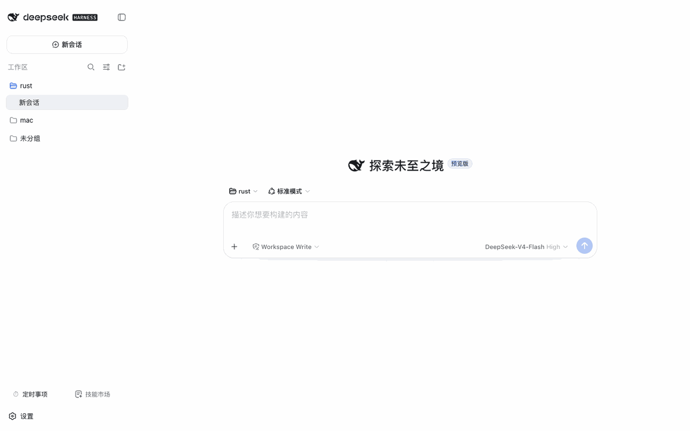

# @weibaohui/dsh-sync

[](https://github.com/topics/dsh-plugin)
[](https://www.npmjs.com/package/@weibaohui/dsh-sync)

**多机同步插件**：让多台机器上的 dsh 通过一个私有 GitCode 仓库保持一致——技能、会话、设置、插件清单都能同步。



## 核心功能

- **四类内容可同步**（各有独立开关）：
  - 技能（skills，默认开）
  - 会话记录（默认关，体积大）
  - 设置（settings.yaml，默认开）
  - 插件清单（各 profile 的依赖与配置，默认开）
- **更新检测**（类似 git status / fetch 的及时提示）：
  - **本机改动**：指纹走查（文件 mtime+size）+ 内容级分类（`git hash-object` 对比同步基线），报出 新增/修改/删除 清单——只读、不拷贝、不动影子仓库
  - **远端更新**：定时 `fetch` 对比基线，另一台机器推了新内容会显示「远端有 N 个新提交」及文件清单、提交记录
  - `fs.watch` 监视本地文件变化（秒级感知）+ 定时检测循环（默认 5 分钟，可配）；检测到变化时状态卡冒出「立即同步」按钮
- **分支 → PR → 合并**：每台机器的变更以 PR 形式提交，冲突显化为一个待合并的 PR，绝不静默覆盖
- **同步前自动回填**：每次推送前先把远端新增、本机没动过的内容拉回本机，本机快照不会误删别的机器推上来的新技能/新配置
- **AI 智能对齐**：点「AI 智能对齐」，先自动回填远端新增，再由 AI 对两边都改过的文件做语义合并（动手前自动备份本机文件），合并后自动推送；仍冲突的 PR 顺手解决
- **AI 一键解决冲突**：出现冲突时设置页冒出「AI 解决冲突」按钮，点击后自动分析两边改动并合并，确定性的 git 操作不用你动手
- **安全**：强制私有仓库（公共仓库直接拒绝保存）；访问 token 只写不回读
- **拉取安全**：pull 只回写本地没动过的远端变更，本地改过的内容不会被覆盖

## 安装

```bash
dsh plugin --profile web add @weibaohui/dsh-sync -w
```

装完重启 `dsh web` 即生效。

## 使用

1. 到 [gitcode.com](https://gitcode.com) 创建一个**私有**仓库（插件不会代建）
2. 打开 Web UI → **设置页 → dsh-sync**，填入仓库地址与 access token，保存
3. 按需开关四类同步内容
4. 之后每次修改，通过同步操作把本机变更推成 PR；多机之间即可保持一致
5. 日常可点「AI 智能对齐」让 AI 先回填远端新增、语义合并双方改动；出现冲突时设置页会出现「AI 解决冲突」按钮，点一下即可

## 忽略清单（不同步的文件）

默认会把勾选组内的所有文件都同步。若有些文件不想上传（体积大、机器本地临时文件、特定技能），
维护一份 **gitignore 语法**的忽略清单即可——每台机器各自维护，**不会**随同步上传：

```bash
# 路径：~/.dsh/dsh-sync/.gitignore（首次运行自动生成默认模板，可自由编辑）
# 语法与 .gitignore 完全一致：模式行、目录想/、**、用 ! 反转
*.tmp
.DS_Store
skills/agents/某个不想同步的技能/
```

- 忽略清单通过影子仓库的 `core.excludesFile` 接入 git 自己的忽略引擎，`add` 与更新检测都一致生效
- 已被同步过、后又加入忽略清单的文件，会在下一次 push 时从远端静默移除（不影响本地文件）
- 编辑后立即生效，无需重启实例

## 联系我 :飞书群


